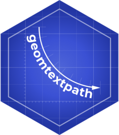

<!-- README.md is generated from README.Rmd. Please edit that file -->

```{r, include = FALSE}
knitr::opts_chunk$set(
  collapse = TRUE,
  comment = "#>",
  fig.path = "man/figures/README-",
  out.width = "100%",
  fig.align = "center",
  dev = "ragg_png", # <- prevent default Windows device to render plots
  dpi = 176
)
```

# geomtextpath 

<!-- badges: start -->
[](https://CRAN.R-project.org/package=geomtextpath)
[](https://github.com/AllanCameron/geomtextpath/actions)
[](https://codecov.io/gh/AllanCameron/geomtextpath?branch=main)
<!-- badges: end -->

## Create curved text in ggplot2

The existing text-based geom layers in ggplot2 (`geom_text` and `geom_label`) are ideal for the majority of plots, since typically textual annotations are short, straight and in line with the axes of the plot. However, there are some occasions when it is useful to have text follow a curved path. This may be to create or recreate a specific visual effect, or it may be to label a circular / polar plot in a more "natural" way.

## Installation

You can install the development version of geomtextpath from [GitHub](https://github.com/) with:

``` r
# install.packages("remotes")
remotes::install_github("AllanCameron/geomtextpath")
```
## Examples

```{r library}
library(geomtextpath)
```

### Plotting text along an arbitrary path

```{r spiral}
t <- seq(-1, 5, length.out = 1000) * pi
spiral <- data.frame(
  x = rev(sin(t) * 1000:1),
  y = rev(cos(t) * 1000:1),
  s = seq(1, 10, length.out = 100),
  text = paste(
    "Like a circle in a spiral, like a wheel within a wheel,",
    "never ending or beginning on an ever spinning reel"
  )
)

ggplot(spiral, aes(x, y, label = text)) +
  geom_textpath(size = 7, vjust = 2, linewidth = 0) +
  coord_equal(xlim = c(-1500, 1500), ylim = c(-1500, 1500))
```

### Produce labelled density lines

By default, the paths are broken to allow the names in-line.

```{r density_demo}
ggplot(iris, aes(x = Sepal.Length, colour = Species)) +
  geom_textpath(aes(label = Species), stat = "density",
                size = 6, fontface = 2, hjust = 0.2, vjust = 0.3)
```

If the `vjust`  parameter moves the text above or below the line, the line is automatically filled in.

```{r density_vjust}
ggplot(iris, aes(x = Sepal.Length, colour = Species)) +
  geom_textpath(aes(label = Species), stat = "density",
                size = 6, fontface = 2, hjust = 0.2, vjust = -0.2)
```

### Correction of angles across different aspect ratios

The angle of the text continues to follow the path even if the aspect ratio of the plot changes, for example, during faceting. Compare faceting horizontally:
```{r horizontal_facets}
p <- ggplot(iris, aes(x = Sepal.Length, colour = Species)) +
       geom_textpath(aes(label = Species), stat = "density",
                     size = 6, fontface = 2, hjust = 0.1, vjust = -0.2) +
       scale_y_continuous(limits = c(0, 1.5))

p + facet_grid(.~Species)
```

to faceting vertically:
```{r vertical_facets}
p + facet_grid(Species~.)
```

The text will continue to rotate appropriately as the plotting window is rescaled.

### Labelling groups of point along their trend line

```{r smooth}
ggplot(iris, aes(x = Sepal.Length, y = Petal.Length)) +
  geom_point(alpha = 0.1) +
  geom_textpath(aes(label = Species, colour = Species),
                stat = "smooth", method = "loess", formula = y ~ x,
                size = 7, linetype = 3, fontface = 2, linewidth = 1) +
  scale_colour_manual(values = c("forestgreen", "deepskyblue4", "tomato4")) +
  theme_bw()
```


### Text paths in polar coordinates

Straight text paths in Cartesian coordinates become curved in polar coordinates.

```{r coords_cartesian}
df <- data.frame(x = 1:1000, y = 1, text = "This is a perfectly flat label")

p <- ggplot(df, aes(x, y, label = text)) +
  geom_textpath(size = 6)
p
```

```{r coords_polar}
p + coord_polar(start = pi)
```

## Limitations

There are limitations inherent in the plotting of text elements in ggplot due to the way that the underlying `grid` graphics handles text. A text string is dealt with as a zero-width object, and therefore the rotation and spacing of the letters making up the string can only be dealt with by treating each letter separately. 

It is important to realise that the letters are only rotated, and do not undergo any change in shape. Thus, for example, large text appearing on convex curves will not be deformed so that individual letters are narrower at the bottom and wider at the top. Doing so would require reinterpreting the letters as polygons.

Another issue is that we may wish to use a short curved label on a much longer path. Spacing the letters equally along the path would mean there is too much space between the letters for the label to remain legible. A single text string is therefore kept "together" according to the point size of the text in `geom_textpath`. This then leaves the problem of where on the path the text should be placed. This can be dealt with by the aesthetic mapping `hjust`, which allows the user to place the labels at the desired position along the path, including separate positions for each label.

A final point to note is that a path is usually a group-based geom (i.e. a path typically comprises x, y points from two columns over several rows of a data frame), whereas text labels can come from single rows in a data frame. This means that if we have a data frame with an x column, a y column and a grouping variable column, there can only be a single label for the group. Typically, this will be the grouping variable itself (see the examples, particularly those using the built-in iris data set.)
