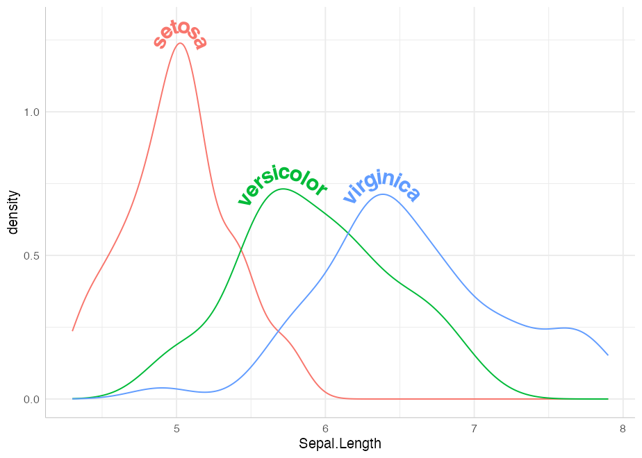
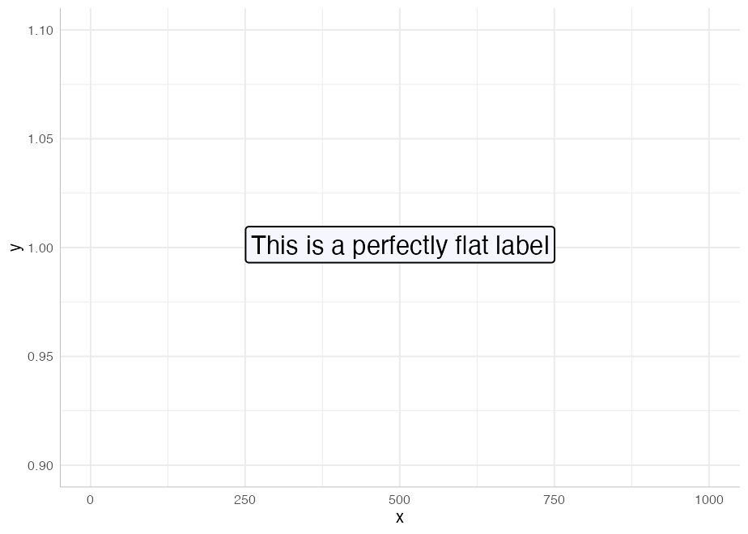
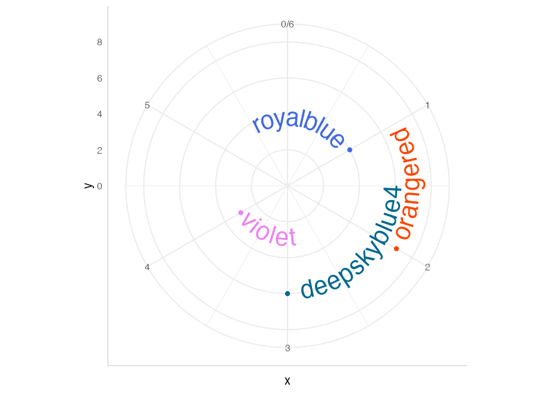

<!-- README.md is generated from README.Rmd. Please edit that file -->

# geomtextpath 

<!-- badges: start -->

[](https://CRAN.R-project.org/package=geomtextpath)
[](https://github.com/AllanCameron/geomtextpath/actions)
[](https://codecov.io/gh/AllanCameron/geomtextpath?branch=main)
<!-- badges: end -->

## Create curved text in ggplot2

The existing text-based geom layers in ggplot2 (`geom_text` and
`geom_label`) are ideal for the majority of plots, since typically
textual annotations are short, straight and in line with the axes of the
plot. However, there are some occasions when it is useful to have text
follow a curved path. This may be to create or recreate a specific
visual effect, or it may be to label a circular / polar plot in a more
“natural” way.

## Installation

You can install the development version of geomtextpath from
[GitHub](https://github.com/) with:

``` r
# install.packages("remotes")
remotes::install_github("AllanCameron/geomtextpath")
```

## Using **geomtextpath**

Once installed, we simply call:

``` r
library(geomtextpath)
#> Loading required package: ggplot2
```

The main function in this package, `geom_textpath`, functions much as
any other `geom` in `ggplot2`, taking its x co-ordinates, its y
co-ordinates and its text label from an aesthetic mapping. At its most
basic, this allows the `label` to be plotted on an arbitrary path, as
shown in the following example:

``` r
t <- seq(5, -1, length.out = 1000) * pi

spiral <- data.frame(x    = sin(t) * 1:1000, 
                     y    = cos(t) * 1:1000,
                     text = paste("Like a circle in a spiral,",
                                  "like a wheel within a wheel,",
                                  "never ending or beginning,",
                                  "on an ever spinning reel")
                     )

ggplot(spiral, aes(x, y, label = text)) +
  geom_textpath(size = 7, vjust = 2, include_line = FALSE) +
  coord_equal(xlim = c(-1500, 1500), ylim = c(-1500, 1500))
```


Of course, we can create the path data from various “stat”
transformations, and generate the labels from the grouping variables we
are plotting. This allows very easy labeling of density curves:

``` r
ggplot(iris, aes(x = Sepal.Length, colour = Species)) +
  geom_textpath(aes(label = Species), stat = "density",
                size = 6, fontface = 2, hjust = 0.2, vjust = 0.3)
```


We can also use `stat_smooth` to get labelled trend lines through
scatterplots:

``` r
ggplot(iris, aes(x = Sepal.Length, y = Petal.Length)) +
  geom_point(alpha = 0.1) +
  geom_textpath(aes(label = Species, colour = Species),
                stat = "smooth", method = "loess", formula = y ~ x,
                size = 7, linetype = 3, fontface = 2, linewidth = 1) +
  scale_colour_manual(values = c("forestgreen", "deepskyblue4", "tomato4")) +
  theme_bw()
```


And of course, arbitrary functions can be labelled with paths created in
`stat_function`:

``` r
ggplot() + 
  xlim(c(0, 1)) + 
  stat_function(geom = "textpath",
                fun = dgamma, color = "red4",
                label = "gamma distribution with shape = 1",
                size = 5, vjust = -0.2, hjust = 0.1, args = list(shape = 1)) +
  stat_function(geom = "textpath",
                fun = dgamma, color = "blue4",
                label = "gamma distribution with shape = 2",
                size = 5, vjust = -0.2, hjust = 0.1, args = list(shape = 2)) +
  stat_function(geom = "textpath",
                fun = dgamma, color = "green4",
                label = "gamma distribution with shape = 3",
                size = 5, vjust = -0.2, hjust = 0.1, args = list(shape = 3)) +
  theme_bw()
```


### Controlling text position

Just like `geom_text`, the `vjust` parameter controls vertical
justification of the text, though in `geom_textpath` the text is
justified relative to the path rather than a single point. If the
`vjust` parameter moves the text above or below the line, the line is
automatically “filled in”.

For short text labels applied to long paths, we need a parameter to
control how far along the path the text is placed. For this we use the
horizontal justification (`hjust`) parameter.

The behaviour of the `vjust` and `hjust` parameters is described in more
detail in the “aesthetics” vignette.

Here is an example of text justified above the line of the path:

``` r
ggplot(iris, aes(x = Sepal.Length, colour = Species)) +
  geom_textpath(aes(label = Species), stat = "density",
                size = 6, fontface = 2, hjust = 0.2, vjust = -0.2)
```



### Correction of angles across different aspect ratios

The angle of the text continues to follow the path even if the aspect
ratio of the plot changes, for example, during faceting. Compare
faceting horizontally:

``` r
p <- ggplot(iris, aes(x = Sepal.Length, colour = Species)) +
       geom_textpath(aes(label = Species), stat = "density",
                     size = 6, fontface = 2, hjust = 0.2, vjust = -0.2) +
       scale_y_continuous(limits = c(0, 1.5))

p + facet_grid(.~Species)
```


to faceting vertically:

``` r
p + facet_grid(Species~.)
```


The text will continue to rotate appropriately as the plotting window is
rescaled.

### Text paths in polar coordinates

Straight text paths in Cartesian coordinates become curved in polar
coordinates.

``` r
df <- data.frame(x = c(1, 1000), y = 1, text = "This is a perfectly flat label")

p <- ggplot(df, aes(x, y, label = text)) +
  geom_textpath(size = 6, include_line = FALSE) +
  ylim(c(0.9, 1.1))

p
```



``` r
p + coord_polar()
```


We have even included the ability to have *point-like* text paths. While
this sounds paradoxical, it means that `geom_textpath` can be used as a
drop-in for `geom_text`, and will behave in much the same way, with the
exception that the text will automatically curve in polar co-ordinates.
The best way to show this is with a head-to-head comparison.

``` r
df <- data.frame(x = 1:4, y = c(4, 7, 6, 3),
                 color = c("royalblue", "orangered", "deepskyblue4", "violet"))

p <- ggplot(df, aes(x, y, color = color, label = color)) +
       geom_point(size = 3) +
       scale_color_identity() +
       lims(x = c(0, 6), y = c(0, 8)) +
       theme_bw()

p_text     <- p + geom_text(size = 8, hjust = -0.1)
p_textpath <- p + geom_textpath(size = 8, hjust = -0.1)
```

Note that `p_text` and `p_textpath` are made with the same base plot and
data. In normal Cartesian Co-ordinates they are essentially identical:

``` r
p_text
```


``` r
p_textpath
```


But note the difference when we switch to polar co-ordinates:

``` r
p_text + coord_polar()
```



``` r
p_textpath + coord_polar()
```


By default, any labels that would have been upside down (or even mostly
upside down) are automatically flipped to be facing in a legible
direction. This can be turned off using `flip_inverted = FALSE` in the
call to `geom_textpath`.

We can even construct complex diagrammatic plots:

``` r
p <- data.frame(x1 = c(seq(0, 10/6 * pi, pi/3),
                  seq(0, 10/6 * pi, 2*pi/3)),
           y1 = c(rep(2, 6), rep(-1, 3)),
           x2 = c(seq(0, 10/6 * pi, pi/3)  + pi/3,
                  seq(0, 10/6 * pi, 2*pi/3) + 2*pi/3),
           y2 = c(rep(4, 6), rep(2, 3)),
           group = letters[c(1:6, (1:3) * 2)],
           alpha = c(rep(1, 6), rep(0.4, 3))) |>
  ggplot(aes(x1, y1)) +
  geom_rect(aes(xmin = x1, xmax = x2, ymin = y1, ymax = y2, fill = group,
                alpha = alpha),
            color = "white", size = 2) +
  geom_textpath(data = data.frame(x1 = seq(0, 2 * pi, length = 300),
           y1 = rep(0.5, 300),
           label = rep(c("stats", "effects", "polar"), each = 100)),
           aes(label = label), linetype = 0, size = 8,
           flip_inverted = TRUE) +
  geom_textpath(data = data.frame(x1 = seq(0, 2 * pi, length = 300),
           y1 = rep(3, 300),
           label = rep(c("density", "smooth", "unique", "organic",
                         "easy to use", "automatic"), 
                       each = 50)),
           aes(label = label), linetype = 0, size = 4.6, color = "white",
           flip_inverted = TRUE) +
  scale_y_continuous(limits = c(-5, 4)) +
  scale_x_continuous(limits = c(0, 2*pi)) +
  scale_fill_manual(values = c("deepskyblue3", "deepskyblue4",
                               "green3", "green4","tomato", "tomato2")) +
  scale_alpha_identity() +
  theme_void() +
  theme(legend.position = "none") 

p
```


That flip nicely to polar co-ordinates.

``` r
p + coord_polar()
```


## `coord_curvedpolar`

Another function exported from this package is `coord_curvedpolar`. This
behaves identically to `coord_polar`, except that the circumferential
axis labels are curved. For example:

``` r
clock <- function(x) {
  
  hours <- c(rep(x[1] %% 12 + tail(x, 1) / 60, 2), 0, 3)
  minutes <- c(rep(tail(x, 1)/5, 2), 0, 5)

  ggplot(as.data.frame(rbind(hours, minutes)), aes(V1, V3)) + 
      geom_segment(aes(xend = V2, yend = V4), 
                   size = c(3, 2.5), lineend = "round") +
      geom_point(x = 0, y = 0, size = 5) +
      scale_x_continuous(limits = c(0, 12), breaks = 1:12,
                         label = as.roman) +
      theme_void() + 
      theme(axis.text.x = element_text(size = 30, face = 2))
}

clock(03:35) + coord_polar()
```


``` r
clock(19:15) + coord_curvedpolar()
```


This can be useful to achieve a particular aesthetic effect (as above),
but can also be of practical utility when axis labels are long, which
can produce some problems in standard `coord_polar`:

``` r
df <- data.frame(x = c("A long axis label", "Another long label",
                       "The longest label of all", "Yet another label"),
                 y = c(8, 6, 10, 4))

p <- ggplot(df, aes(x, y)) + 
      geom_col(width = 0.5) +
      theme(axis.text.x = element_text(size = 18))

p + coord_polar()
```


``` r
p + coord_curvedpolar()
```


You can see more examples in the vignettes.

## Limitations

There are limitations inherent in the plotting of text elements in
ggplot due to the way that the underlying `grid` graphics handles text.
A text string is dealt with as a zero-width object, and therefore the
rotation and spacing of the letters making up the string can only be
dealt with by treating each letter separately.

It is important to realise that the letters are only rotated, and do not
undergo any change in shape. Thus, for example, large text appearing on
convex curves will not be deformed so that individual letters are
narrower at the bottom and wider at the top. Doing so would require
reinterpreting the letters as polygons.

Another issue is that we may wish to use a short curved label on a much
longer path. Spacing the letters equally along the path would mean there
is too much space between the letters for the label to remain legible. A
single text string is therefore kept “together” according to the point
size of the text in `geom_textpath`.
