<!-- README.md is generated from README.Rmd. Please edit that file -->

# geomtextpath 

<!-- badges: start -->

[](https://CRAN.R-project.org/package=geomtextpath)
[](https://github.com/AllanCameron/geomtextpath/actions)
[](https://app.codecov.io/gh/AllanCameron/geomtextpath?branch=main)
[](https://cran.r-project.org/package=geomtextpath)
<!-- badges: end -->

## Create curved text in ggplot2

The existing text-based geom layers in ggplot2 (`geom_text` and
`geom_label`) are ideal for the majority of plots, since typically
textual annotations are short, straight and in line with the axes.
However, there are some occasions when it is useful to have text follow
a curved path. This may be to create or recreate a specific visual
effect, or it may be to label a circular / polar plot in a more
“natural” way. Direct and automatic text labels that adhere to their
associated line can also provide a neat alternative to legends, without
the need for specifying exact label positions, and with a lower risk of
overplotting.

Using geomtextpath, your text can follow any path, and will remain
correctly spaced and angled, even if you change the size and aspect
ratio of your plotting device. It does so without the need to redraw
your plot each time, as shown in the
[introduction](https://allancameron.github.io/geomtextpath/articles/geomtextpath.html)
vignette.

## Installation

You can install geomtextpath from CRAN using

``` r
install.packages("geomtextpath")
```

Alternatively, you can install the latest development version of
geomtextpath from [GitHub](https://github.com/) with:

``` r
remotes::install_github("AllanCameron/geomtextpath", quiet = TRUE)
```

## Using **geomtextpath**

Once installed, we simply call:

``` r
library(geomtextpath)
#> Loading required package: ggplot2
```

The core functions in this package, `geom_textpath` and
`geom_labelpath`, work like any other `geom` in `ggplot2`. They take
their x co-ordinates, their y co-ordinates and their text label from an
aesthetic mapping. At its most basic, this allows the `label` to be
plotted on an arbitrary path, as shown in the following example:

``` r
# Set a consistent theme for the plots here
theme_set(theme_minimal() + 
          theme(axis.line = element_line(linewidth = 0.25, colour = "gray75")))

t <- seq(5, -1, length.out = 1000) * pi

spiral <- data.frame(x    = sin(t) * 1:1000, 
                     y    = cos(t) * 1:1000,
                     text = paste("Like a circle in a spiral,",
                                  "like a wheel within a wheel,",
                                  "never ending or beginning,",
                                  "on an ever spinning reel")
                     )

ggplot(spiral, aes(x, y, label = text)) +
  geom_textpath(size = 7, vjust = 2, text_only = TRUE) +
  coord_equal(xlim = c(-1500, 1500), ylim = c(-1500, 1500))
```


If we want our text in a box, even when the text is curved, we can use
`geom_labelpath` instead:

``` r

set.seed(5)
x  <- runif(5)
y  <- runif(5)
df <- data.frame(x = spline(1:5, x, xout = seq(1, 5, 1/100))$y,
                 y = spline(1:5, y, runif(5), xout = seq(1, 5, 1/100))$y,
                 z = "A curved textbox on an arbitrary path")

ggplot(df, aes(x, y, label = z)) + 
  geom_labelpath(size = 5, fill = "#F6F6FF", hjust = 0.55) +
  geom_point(data = data.frame(x = x, y = y, z = 1))
```

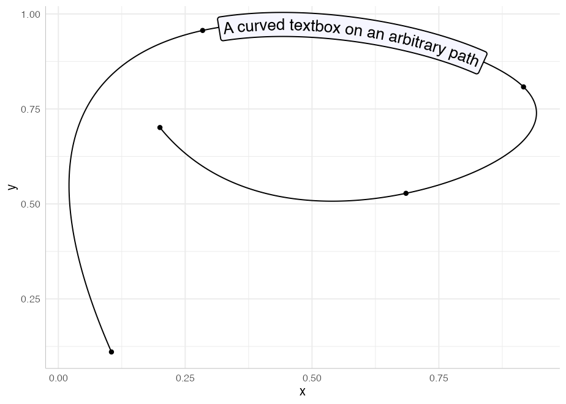

Of course, the point of this package is not to produce such graphical
novelties, but to provide an easy and visually appealing way to present
your data. Just as `geom_path` is the foundation for several other geoms
in `ggplot2`, so too are `geom_textpath` and `geom_labelpath` the
foundation of the other geoms in this package. The line-based geoms in
`ggplot` all have two equivalents in this package:

| **ggplot geom**  | **Text equivalent**  | **Label equivalent**  |
|:-----------------|:---------------------|:----------------------|
| `geom_path`      | `geom_textpath`      | `geom_labelpath`      |
| `geom_segment`   | `geom_textsegment`   | `geom_labelsegment`   |
| `geom_line`      | `geom_textline`      | `geom_labelline`      |
| `geom_abline`    | `geom_textabline`    | `geom_labelabline`    |
| `geom_hline`     | `geom_texthline`     | `geom_labelhline`     |
| `geom_vline`     | `geom_textvline`     | `geom_labelvline`     |
| `geom_curve`     | `geom_textcurve`     | `geom_labelcurve`     |
| `geom_density`   | `geom_textdensity`   | `geom_labeldensity`   |
| `geom_smooth`    | `geom_textsmooth`    | `geom_labelsmooth`    |
| `geom_contour`   | `geom_textcontour`   | `geom_labelcontour`   |
| `geom_density2d` | `geom_textdensity2d` | `geom_labeldensity2d` |
| `geom_sf`        | `geom_textsf`        | `geom_labelsf`        |

Each of these aims to replicate all the functionality of the equivalent
`ggplot2` function, but with direct text labels that follow the shape of
the lines drawn.

For the special case of `geom_sf`, which draws different shapes based on
the geometry objects drawn, the equivalent `geom_textsf` and
`geom_labelsf`, will identify and label the linestring components
(typically rivers and roads), without attempting to label polygons.

### `geom_textline` and `geom_labelline`

You can use `geom_textline` and `geom_labelline` as a drop in for
`geom_line` if you want it directly labelled. Just pass the `label` you
want as an argument to `geom_textline` (or if you have grouped data, you
can pass the label as an aesthetic mapping). As in the other geoms here,
you can specify the line’s appearance and the text’s appearance
separately.

``` r
ggplot(pressure, aes(temperature, pressure)) +
  geom_textline(label = "Mercury vapor pressure", size = 6, vjust = -0.5,
                linewidth = 1, linecolor = "red4", linetype = 2, 
                color = "deepskyblue4")
```

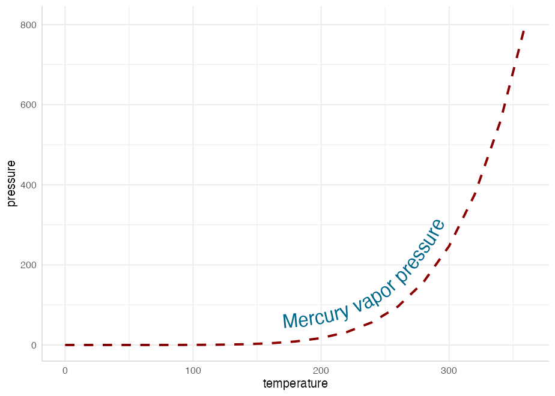

### `geom_textdensity` and `geom_labeldensity`

These are the analogues of `geom_density` that allows for smoothly
curved labels on density plots

``` r
ggplot(iris, aes(x = Sepal.Length, colour = Species, label = Species)) +
  geom_textdensity(size = 6, fontface = 2, hjust = 0.2, vjust = 0.3) +
  theme(legend.position = "none")
```

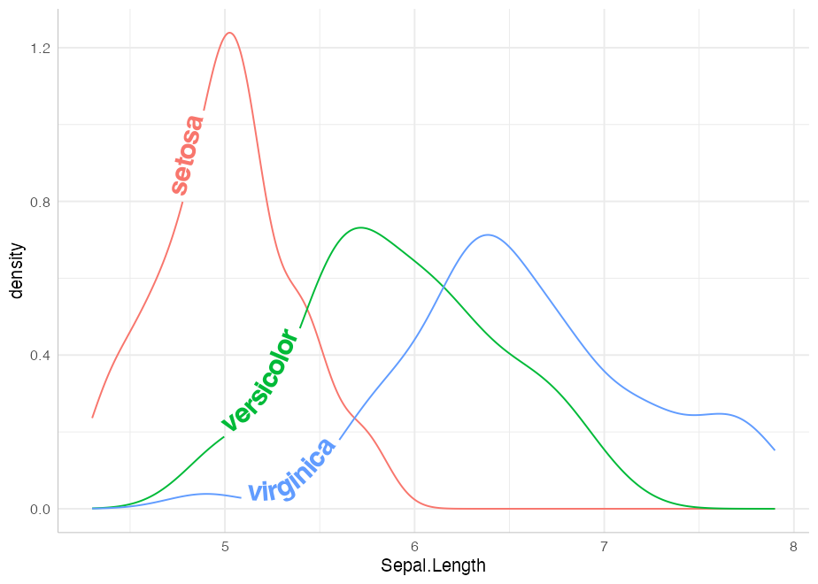

Note that we have been able to “reclaim” the space normally taken up by
the legend without leaving any ambiguity in the plot.

### `geom_textsmooth` and `geom_labelsmooth`

We can use these geoms to get labelled trend lines through scatterplots:

``` r
ggplot(iris, aes(x = Sepal.Length, y = Petal.Length, color = Species)) +
  geom_point(alpha = 0.3) +
  geom_labelsmooth(aes(label = Species), text_smoothing = 30, fill = "#F6F6FF",
                method = "loess", formula = y ~ x,
                size = 4, linewidth = 1, boxlinewidth = 0.3) +
  scale_colour_manual(values = c("forestgreen", "deepskyblue4", "tomato4")) +
  theme(legend.position = "none")
```


Note that by design, we have not included the standard error ribbon in
these geoms because the naming of the `fill` aesthetic would clash with
the fill of the text boxes. If necessary, a standard `geom_smooth` can
be drawn first to obtain the ribbon.

### Labelled contour lines

Adding labels to the level of your contour lines is now as simple as
calling `geom_textcontour` or `geom_labelcontour` instead of
`geom_contour`:

``` r

df <- expand.grid(x = seq(nrow(volcano)), y = seq(ncol(volcano)))
df$z <- as.vector(volcano)

ggplot(df, aes(x, y, z = z)) + 
  geom_contour_filled(bins = 6, alpha = 0.6) + 
  geom_textcontour(bins = 6, size = 2.5, straight = TRUE) + 
  scale_fill_manual(values = terrain.colors(11)) + 
  theme(legend.position = "none")
```

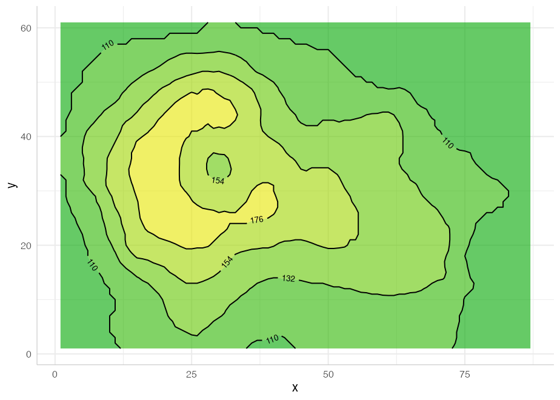

We also have `geom_textdensity2d` and `geom_labeldensity2d` for the
common use case of 2D density contours:

``` r
set.seed(1)

df  <- data.frame(x = rnorm(100), y = rnorm(100))

ggplot(df, aes(x, y)) + 
  geom_textdensity2d()
```

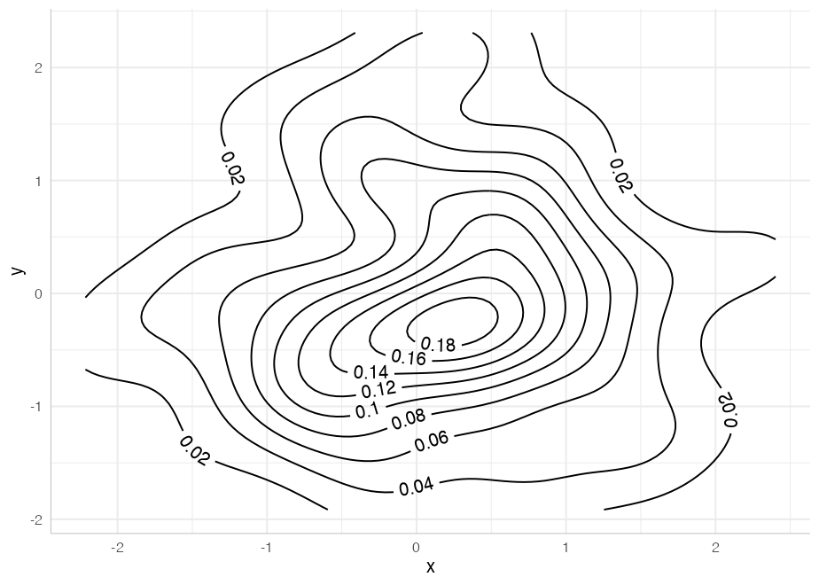

### `geom_textsf` and `geom_labelsf`

These geoms behave much the same way as `geom_sf`, except linestrings
such as rivers and roads can be given (curved) text labels:

``` r

library(sf)
#> Linking to GEOS 3.11.0, GDAL 3.5.3, PROJ 9.1.0; sf_use_s2() is TRUE
```

``` r

df <- data.frame(x = c(-4.2518, -3.1883), 
                 y = c(55.8642, 55.9533),
                 label = c("Glasgow", "Edinburgh"))

ggplot(data = df) +
  geom_textsf(data = waterways,
              aes(label = name), text_smoothing = 65, linecolour = "#8888B3", 
              color = "gray30", vjust = -0.8, fill = "#E6F0B3", 
              alpha = 0.8, fontface = 3, size = 3) + 
  geom_point(aes(x, y), data = df, color = "gray50", size = 3) + 
  geom_textpath(aes(x, y, label = label), color = "gray50",
                hjust = c(-0.2, 1.2)) +
  theme(panel.grid = element_line()) + 
  lims(x = c(-4.7, -3), y = c(55.62, 56.25))
```

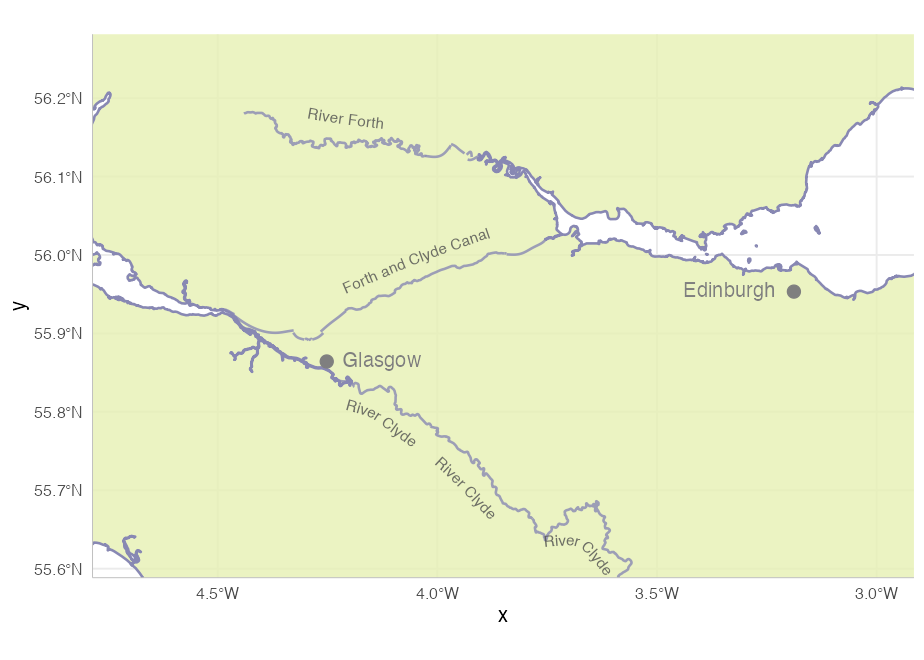

### Reference lines

Often, a reference line added to a plot requires a text annotation. We
can do this directly with `geom_textabline`, `geom_textvline` and
`geom_texthline`, or their text-box equivalents `geom_labelabline`,
`geom_labelvline` and `geom_labelhline`. Although such lines aren’t
curved, there are some benefits to using the `geomtextpath` functions if
a labelled reference line is required: only a single call is needed,
co-ordinates are not required for the text label, the text can be put
in-line with an appropriate break in the line automatically, and the
label will orientate and curve appropriately in polar co-ordinates.

This example shows all three text-based reference line geoms:

``` r
ggplot(mtcars, aes(mpg, disp)) + 
  geom_point() + 
  geom_texthline(yintercept = 200, label = "displacement threshold", 
                 hjust = 0.8, color = "red4") +
  geom_textvline(xintercept = 20, label = "consumption threshold", hjust = 0.8,
                 linetype = 2, vjust = 1.3, color = "blue4") +
  geom_textabline(slope = 15, intercept = -100, label = "partition line", 
                  color = "green4", hjust = 0.6, vjust = -0.2)
#> Warning in geom_texthline(yintercept = 200, label = "displacement threshold", : All aesthetics have length 1, but the data has 32 rows.
#> ℹ Please consider using `annotate()` or provide this layer with data containing
#>   a single row.
#> Warning in geom_textvline(xintercept = 20, label = "consumption threshold", : All aesthetics have length 1, but the data has 32 rows.
#> ℹ Please consider using `annotate()` or provide this layer with data containing
#>   a single row.
```

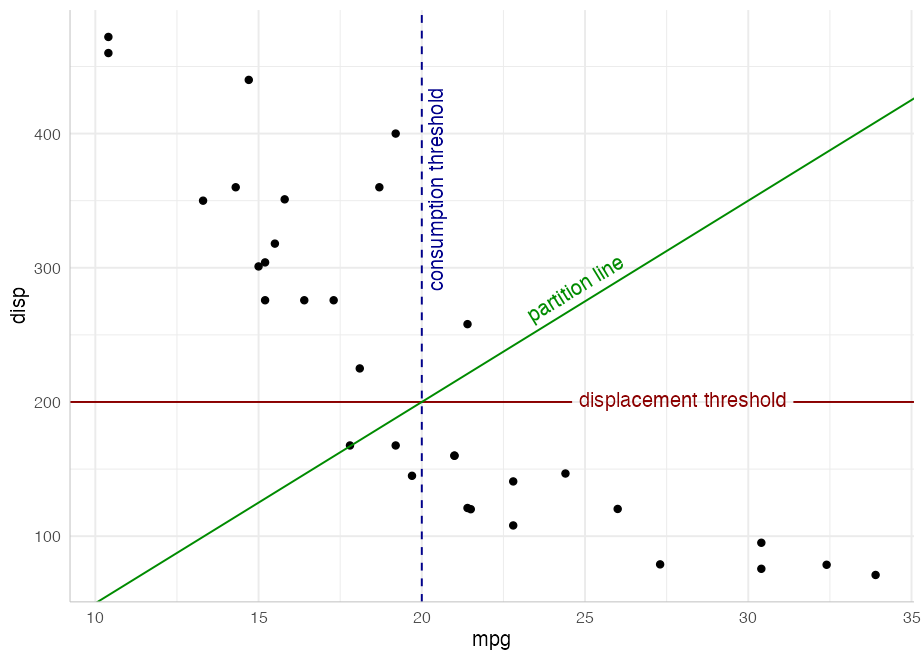

In addition to the straight reference lines, there is also a pair of
geom layers for curved reference lines: `geom_textcurve` and
`geom_labelcurve`. These are typically used for annotations.

``` r
df <- data.frame(Activity = c("Work", "Play"), Happiness = c(0.5, 0.7))

ggplot(df, aes(Activity, Happiness)) + 
  geom_col(fill = "gold", color = "gray50") + 
  geom_textcurve(data = data.frame(x = 1, xend = 2, y = 0.72, yend = 0.52), 
                 aes(x, y, xend = xend, yend = yend), hjust = 0.35, ncp = 20,
                 curvature = -0.8, label = "significant difference") +
  geom_point(aes(y = Happiness + 0.02)) +
  scale_y_continuous(limits = c(0, 1))
```

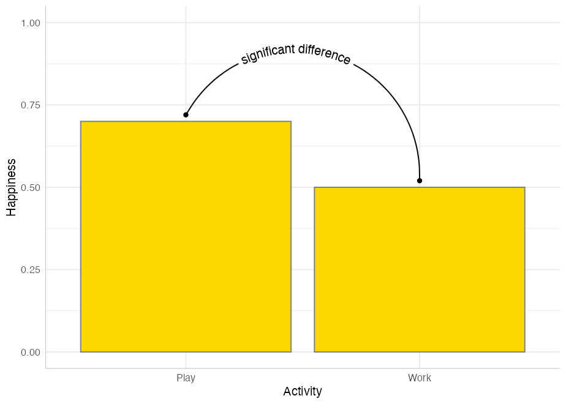

### Arbitrary `stat` transformations

Other “stat” transformations can be used directly on `geom_textpath` and
`geom_labelpath`. For example, functions can be labelled with paths
created in `stat_function`:

``` r
ggplot() + 
  xlim(c(0, 1)) + 
  stat_function(geom = "textpath",
                fun = dgamma, color = "red4",
                label = "gamma distribution with shape = 1",
                size = 5, vjust = -0.2, hjust = 0.1, args = list(shape = 1)) +
  stat_function(geom = "textpath",
                fun = dgamma, color = "blue4",
                label = "gamma distribution with shape = 2",
                size = 5, vjust = -0.2, hjust = 0.1, args = list(shape = 2)) +
  stat_function(geom = "textpath",
                fun = dgamma, color = "green4",
                label = "gamma distribution with shape = 3",
                size = 5, vjust = -0.2, hjust = 0.1, args = list(shape = 3))
```


### Controlling text position

Just like `geom_text`, the `vjust` parameter controls vertical
justification of the text, though in `geom_textpath` and its related
geoms, the text is justified relative to the path rather than a single
point. If the `vjust` parameter moves the text above or below the line,
the line is automatically “filled in”.

For short text labels applied to long paths, we need a parameter to
control how far along the path the text is placed. For this we use the
horizontal justification (`hjust`) parameter. This can be numeric (0 to
1), or can accept position descriptions such as “xmid”, “ymax”, or
“auto”.

Here is an example of text justified above the line of the path using a
small negative value of `vjust`, and the `hjust` set to “ymax” to place
the labels over the peak of each curve:

``` r
p <- ggplot(iris, aes(x = Sepal.Length, colour = Species, label = Species)) +
       theme(legend.position = "none")

p + 
  geom_textdensity(size = 6, fontface = 2, spacing = 50,
                   vjust = -0.2, hjust = "ymax") +
  ylim(c(0, 1.3))
```


You can read more about text positioning in the [aesthetics
vignette](https://allancameron.github.io/geomtextpath/articles/aesthetics.html).

### Smoothing text while preserving path details

Some lines may be too “noisy” or too angular for direct labels to remain
legible if they adhere too closely to the line. We have therefore added
the ability to smooth the text label while keeping the path unaltered,
using a `text_smoothing` parameter, which can be set from 0 (none) to
100 (maximum).

``` r

ggplot(economics, aes(date, unemploy)) +
  geom_textline(linecolour = "grey", size = 4, vjust = -1.5,
                label = "1990s Decline", text_smoothing = 30)
```

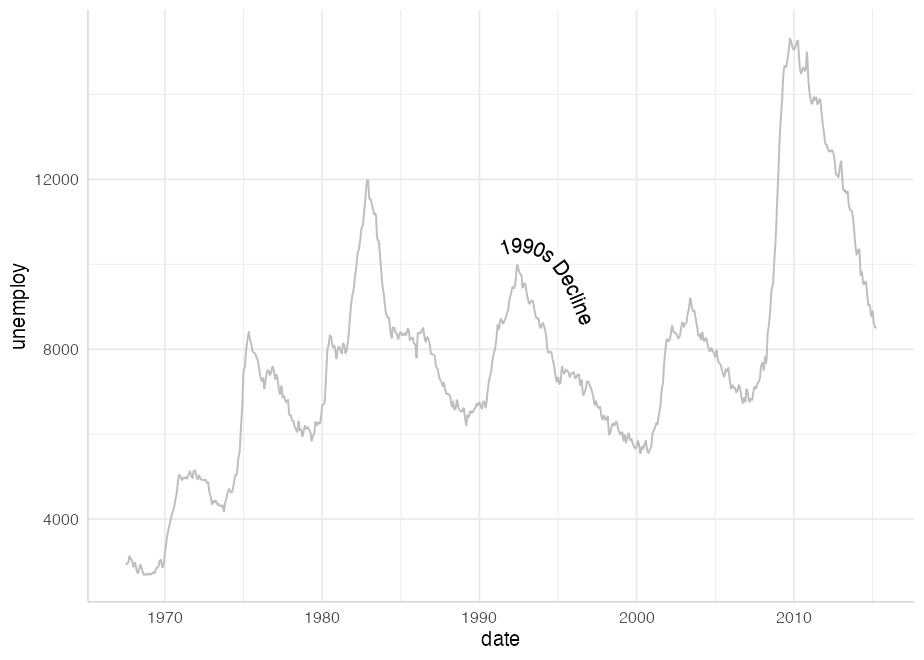

### `Plotmath` support

If you want to use plotmath expressions you can do so much as you would
with `geom_text`. Just tell `geom_textpath` that your labels should be
parsed using `parse = TRUE`

``` r
lab <- expression(paste("y = ", frac(1, sigma*sqrt(2*pi)), " ",
                            plain(e)^{frac(-(x-mu)^2, 2*sigma^2)}))

df <- data.frame(x = seq(-2, 0, len = 100),
                 y = dnorm(seq(-2, 0, len = 100)),
                 z = as.character(lab))

ggplot(df, aes(x, y)) + 
  geom_textpath(aes(label = z), vjust = -0.2, hjust = 0.1, size = 8, parse = TRUE)
```


Note that, due to the way the `grid` package draws plotmath expressions,
all plotmath labels will be straight rather than curved. However, as in
the example above, they will still be angled according to the gradient
of the curve.

### Rich text support

The geoms here also feature richtext support. If you want your text
labels to be interpreted as rich text, simply pass `rich = TRUE` as a
parameter in the call to the geom layer

``` r

lab <- paste("<span style='color:gray30;font-size:10pt'>Plasma</span>",
             "<strong style='color:red4;font-size:10pt'>Indometacin</strong>",
             "<span style ='color:gray30;font-size:10pt'>Concentration </span>",
             "<i style='color:gray50;font-size:8pt'><sub>(\u03BCg/l)</sub></i>")

ggplot(Indometh, aes(time, conc, group = 1)) + 
  geom_textsmooth(formula = y ~ x, method = loess, 
                  label = lab, rich = TRUE, vjust = -0.5, size = 4.5, 
                  text_smoothing = 40, linecolor = "red4") + 
  xlim(c(0, 4))
#> Warning: Removed 18 rows containing non-finite outside the scale range
#> (`stat_smooth()`).
```

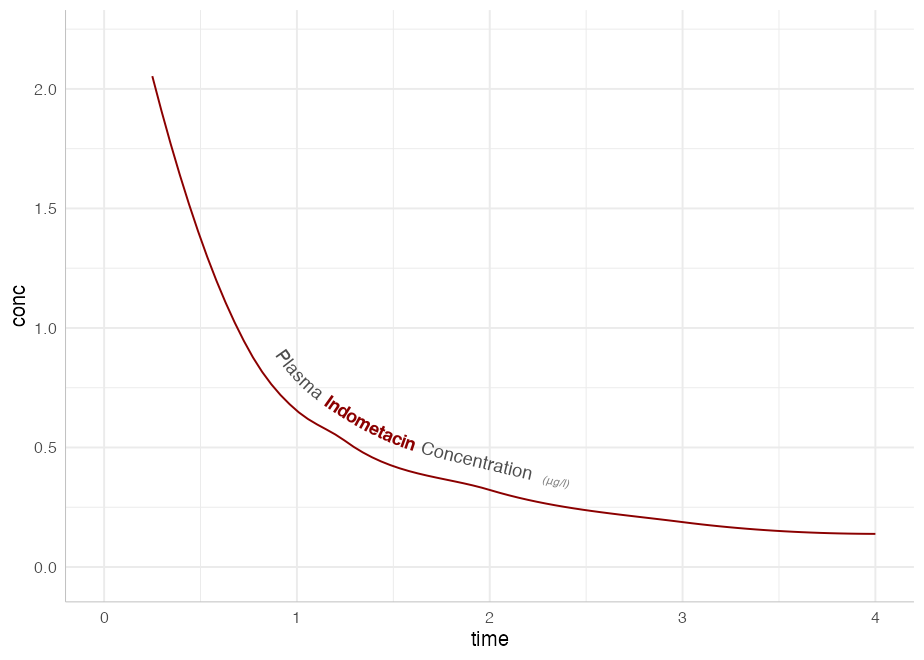

### Text paths in polar coordinates

Straight text paths in Cartesian coordinates become curved in polar
coordinates.

``` r
df <- data.frame(x = c(1, 1000), y = 1, text = "This is a perfectly flat label")

p <- ggplot(df, aes(x, y, label = text)) +
  geom_labelpath(size = 6, text_only = TRUE, fill = "#F6F6FF") +
  ylim(c(0.9, 1.1))

p
```


``` r
p + coord_polar()
```

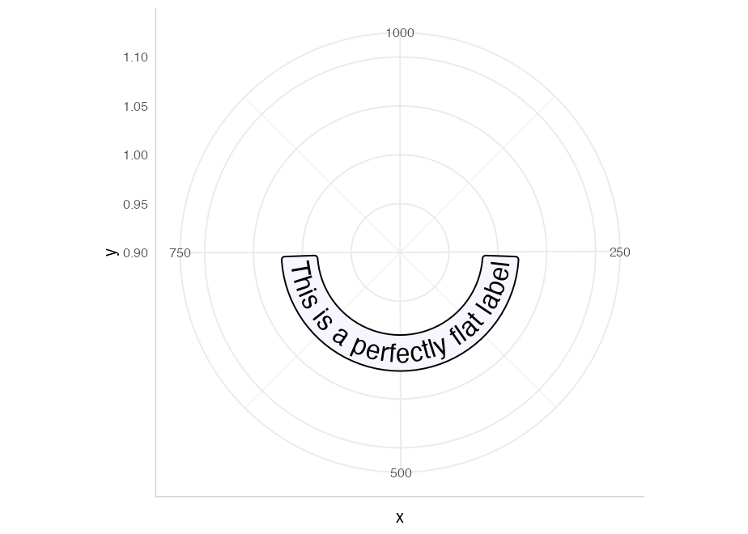

We have included the ability to have *point-like* text paths. While this
sounds paradoxical, it means that `geom_textpath` can be used as a
drop-in for `geom_text`, and will behave in much the same way, with the
exception that the text will automatically curve in polar co-ordinates.
Compare `geom_textpath` used in Cartesian co-ordinates:

``` r
df <- data.frame(x = 1:4, y = c(4, 7, 6, 3),
                 color = c("royalblue", "orangered", "deepskyblue4", "violet"))

p <- ggplot(df, aes(x, y, color = color, label = color)) +
       geom_point(size = 1.5) +
       geom_textpath(size = 8, hjust = -0.1) +
       scale_color_identity() +
       lims(x = c(0, 6), y = c(0, 8)) 

p
```

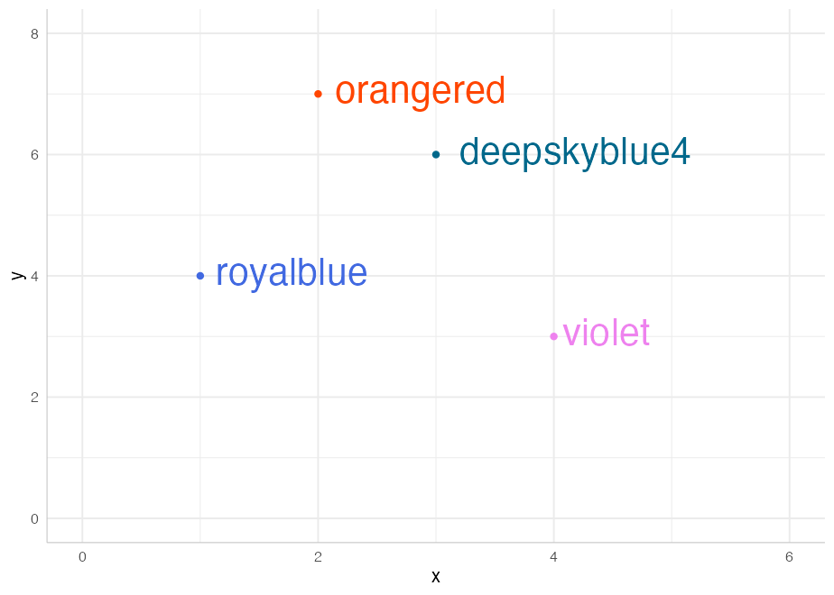

And in polar co-ordinates:

``` r
p + coord_polar()
```


By default, any labels that would have been upside down (or even mostly
upside down) are automatically flipped to be facing in a legible
direction. This can be turned off using `upright = FALSE` in the call to
`geom_textpath`.

We can even construct diagrams or infographics:

``` r
p <- data.frame(x1 = c(seq(0, 10/6 * pi, pi/3),
                  seq(0, 10/6 * pi, 2*pi/3)),
           y1 = c(rep(2, 6), rep(-1, 3)),
           x2 = c(seq(0, 10/6 * pi, pi/3)  + pi/3,
                  seq(0, 10/6 * pi, 2*pi/3) + 2*pi/3),
           y2 = c(rep(4, 6), rep(2, 3)),
           group = letters[c(1:6, (1:3) * 2)],
           alpha = c(rep(1, 6), rep(0.4, 3))) |>
  ggplot(aes(x1, y1)) +
  geom_rect(aes(xmin = x1, xmax = x2, ymin = y1, ymax = y2, fill = group,
                alpha = alpha),
            color = "white", linewidth = 2) +
  geom_textpath(data = data.frame(x1 = seq(0, 2 * pi, length = 300),
           y1 = rep(0.5, 300),
           label = rep(c("stats", "effects", "polar"), each = 100)),
           aes(label = label), linetype = 0, size = 8,
           upright = TRUE) +
  geom_textpath(data = data.frame(x1 = seq(0, 2 * pi, length = 300),
           y1 = rep(3, 300),
           label = rep(c("density", "smooth", "unique", "organic",
                         "easy to use", "automatic"), 
                       each = 50)),
           aes(label = label), linetype = 0, size = 4.6, color = "white",
           upright = TRUE) +
  scale_y_continuous(limits = c(-5, 4)) +
  scale_x_continuous(limits = c(0, 2*pi)) +
  scale_fill_manual(values = c("deepskyblue3", "deepskyblue4",
                               "green3", "green4","tomato", "tomato2")) +
  scale_alpha_identity() +
  theme_void() +
  theme(legend.position = "none") 

p
```


That flip nicely to polar co-ordinates.

``` r

p + coord_polar()
```


## `coord_curvedpolar`

Another function exported from this package is `coord_curvedpolar`. This
behaves identically to `coord_polar`, except that the circumferential
axis labels are curved. For example:

``` r
clock <- function(x) {
  
  hours <- c(rep(x[1] %% 12 + tail(x, 1) / 60, 2), 0, 3.5)
  minutes <- c(rep(tail(x, 1)/5, 2), 0, 5)

  ggplot(as.data.frame(rbind(hours, minutes)), aes(V1, V3)) + 
      geom_segment(aes(xend = V2, yend = V4), 
                   linewidth = c(3, 2), lineend = "round") +
      geom_point(x = 0, y = 0, size = 6) +
      scale_x_continuous(limits = c(0, 12), breaks = 1:12,
                         label = as.roman) +
      scale_y_continuous(limits = c(0, 6), expand = c(0, 0)) +
      theme_void() + 
      theme(axis.text.x = element_text(size = 25, face = 2),
            plot.margin = margin(20, 20, 20, 20))
}

clock(19:15) + coord_curvedpolar()
```

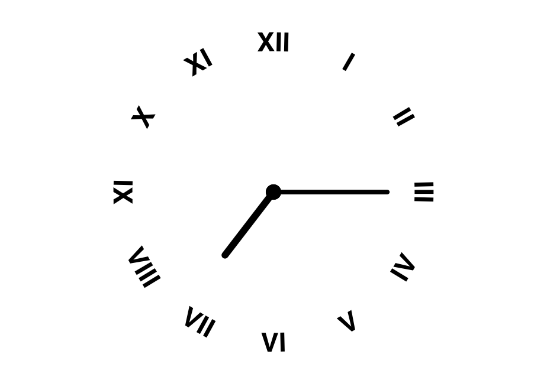

This can be useful to achieve a particular aesthetic effect (as above),
but can also be of practical utility when axis labels are long, which
can produce some problems in standard `coord_polar`:

``` r
df <- data.frame(x = c("A long axis label", "Another long label",
                       "The longest label of all", "Yet another label"),
                 y = c(8, 6, 10, 4))

p <- ggplot(df, aes(x, y, fill = x)) + 
      geom_col(width = 0.5) +
      scale_fill_brewer(type = "qual") +
      theme(axis.text.x = element_text(size = 15),
            legend.position = "none")

p + coord_curvedpolar()
```


## Tips

Not every graphics device renders text equally well. In particular, the
default Windows graphics device makes text look horrible, especially
when placed on paths. To get the best looking results for raster
graphics, we recommend the [{ragg}](https://ragg.r-lib.org/) package.

## Limitations

There are limitations inherent in the plotting of text elements in
ggplot due to the way that the underlying `grid` graphics handles text.
A text string is dealt with as a zero-width object, and therefore the
rotation and spacing of the letters making up the string can only be
dealt with by treating each letter separately.

It is important to realise that the letters are only rotated, and do not
undergo any change in shape. Thus, for example, large text appearing on
convex curves will not be deformed so that individual letters are
narrower at the bottom and wider at the top. Doing so would require
reinterpreting the letters as polygons, which would likely cause more
problems than it would solve.

Other paths may have points of tight curvature, and setting an `offset`
/ `vjust` for the text that is larger than the distance to the focus
point of that curve will produce odd effects. The package tries to
detect and warn the user when this happens, and will suggest remedies.

### Acknowledgments

The authors would like to thank [Patrick
Plenefisch](https://github.com/byteit101) for posting the [Stackoverflow
question](https://stackoverflow.com/questions/69867669/is-there-way-in-ggplot2-to-place-text-on-a-curved-path)
that prompted them to develop this package, and for raising some
important issues early in its development.

Of course this package wouldn’t be possible without the brilliant
[ggplot2](https://github.com/tidyverse/ggplot2) package. Although we’re
grateful to all the developers on the tidyverse team for creating and
maintaining such useful open-source software, we’d like to give
particular thanks to [Claus Wilke](https://github.com/clauswilke) for
also creating the excellent [gridtext](https://wilkelab.org/gridtext/)
package from which `geomtextpath` borrows, and [Thomas Lin
Pedersen](https://github.com/thomasp85), whose
[textshaping](https://github.com/r-lib/textshaping) package was integral
to getting the mechanism working.
