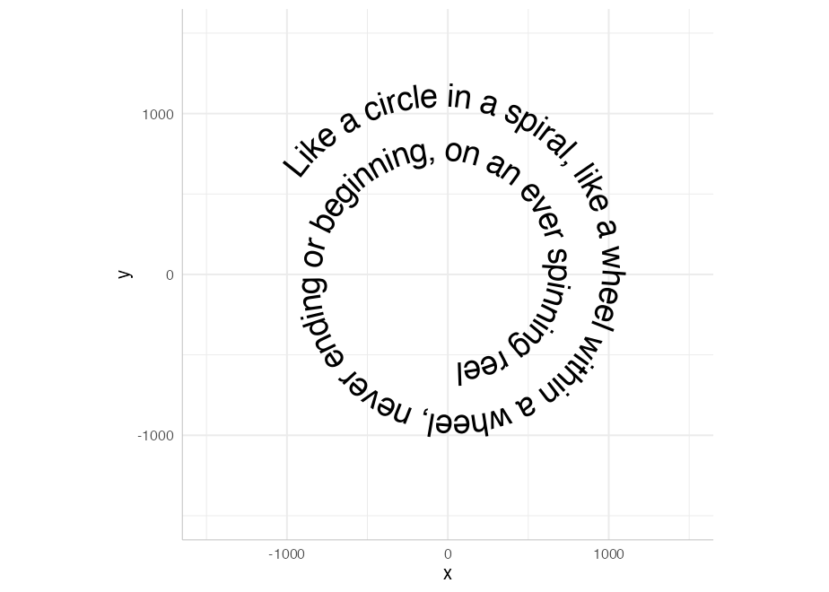
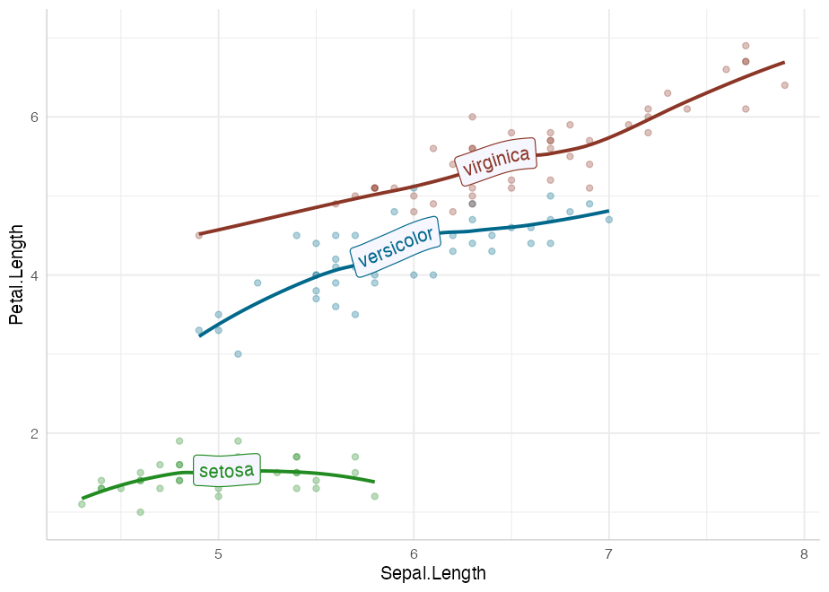
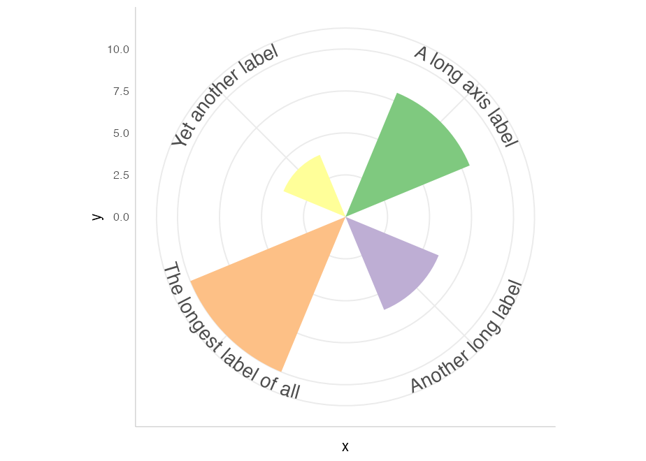

<!-- README.md is generated from README.Rmd. Please edit that file -->

# geomtextpath 

<!-- badges: start -->

[](https://CRAN.R-project.org/package=geomtextpath)
[](https://github.com/AllanCameron/geomtextpath/actions)
[](https://codecov.io/gh/AllanCameron/geomtextpath?branch=main)
<!-- badges: end -->

## Create curved text in ggplot2

The existing text-based geom layers in ggplot2 (`geom_text` and
`geom_label`) are ideal for the majority of plots, since typically
textual annotations are short, straight and in line with the axes.
However, there are some occasions when it is useful to have text follow
a curved path. This may be to create or recreate a specific visual
effect, or it may be to label a circular / polar plot in a more
“natural” way. Direct and automatic text labels that adhere to their
associated line can also provide a neat alternative to legends, without
the need for specifying exact label positions, and with a lower risk of
overplotting.

The text will always stick together and follow the path, even if you
change the size and aspect ratio of your plotting device. It does so
without the need to redraw your plot each time, as shown in the
[introduction](https://allancameron.github.io/geomtextpath/articles/geomtextpath.html)
vignette.

## Installation

You can install the development version of geomtextpath from
[GitHub](https://github.com/) with:

``` r
# install.packages("remotes")
remotes::install_github("AllanCameron/geomtextpath")
```

## Using **geomtextpath**

Once installed, we simply call:

``` r
library(geomtextpath)
#> Loading required package: ggplot2
```

The core function in this package, `geom_textpath`, works like any other
`geom` in `ggplot2`. It takes its x co-ordinates, its y co-ordinates and
its text label from an aesthetic mapping. At its most basic, this allows
the `label` to be plotted on an arbitrary path, as shown in the
following example:

``` r
t <- seq(5, -1, length.out = 1000) * pi

spiral <- data.frame(x    = sin(t) * 1:1000, 
                     y    = cos(t) * 1:1000,
                     text = paste("Like a circle in a spiral,",
                                  "like a wheel within a wheel,",
                                  "never ending or beginning,",
                                  "on an ever spinning reel")
                     )

ggplot(spiral, aes(x, y, label = text)) +
  geom_textpath(size = 7, vjust = 2, include_line = FALSE) +
  coord_equal(xlim = c(-1500, 1500), ylim = c(-1500, 1500))
```



Just as `geom_path` is the foundation for several other geoms in
`ggplot2`, so too is `geom_textpath` the foundation of the other geoms
in this package, which include:

-   `geom_textline`
-   `geom_textdensity`
-   `geom_textsmooth`
-   `geom_textcontour`
-   `geom_textdensity2d`

Each of these aims to replicate all the functionality of the equivalent
`ggplot2` function, but with direct text labels that follow the shape of
the lines drawn.

### `geom_textline`

You can use `geom_textline` as a drop in for `geom_line` if you want it
directly labelled. Just pass the `label` you want as an argument to
`geom_textline` (or if you have grouped data you can pass the label as
an aesthetic mapping). As in the other geoms here, you can specify the
line’s appearance and the text’s appearance separately.

``` r
ggplot(pressure, aes(temperature, pressure)) +
  geom_textline(label = "Mercury vapor pressure", size = 8, vjust = -0.5,
                linewidth = 1, linecolor = "red4", linetype = 2, 
                color = "deepskyblue4") + 
  theme_bw()
```


### `geom_textdensity`

This is the analogue of `geom_density` that allows for smoothly curved
labels on density plots

``` r
ggplot(iris, aes(x = Sepal.Length, colour = Species, label = Species)) +
  geom_textdensity(size = 6, fontface = 2, hjust = 0.2, vjust = 0.3) +
  theme(legend.position = "none")
```


Note that we have been able to “reclaim” the space normally taken up by
the legend without leaving any ambiguity in the plot.

### `geom_textsmooth`

We can use `geom_textsmooth` to get labelled trend lines through
scatterplots:

``` r
ggplot(iris, aes(x = Sepal.Length, y = Petal.Length)) +
  geom_point(alpha = 0.1) +
  geom_textsmooth(aes(label = Species, colour = Species),
                method = "loess", formula = y ~ x,
                size = 7, linetype = 3, fontface = 2, linewidth = 1) +
  scale_colour_manual(values = c("forestgreen", "deepskyblue4", "tomato4")) +
  theme_bw() + 
  theme(legend.position = "none")
```



Another use might be to label lines that are too “noisy” for direct
labels to remain legible if they adhere too closely to the line.

``` r
ggplot(economics, aes(date, unemploy)) +
  geom_line(colour = "grey") +
  geom_textsmooth(aes(label = "Decline"), method = loess, formula = y ~ x,
                  hjust = 0.48, size = 5, method.args = list(span = 0.2),
                  include_line = FALSE, vjust = -0.5)
```


### Labelled contour lines

Adding labels to the level of your contour lines is now as simple as
calling `geom_textcontour` instead of `geom_contour`:

``` r
df <- expand.grid(x = seq(nrow(volcano)), y = seq(ncol(volcano)))
df$z <- as.vector(volcano)

ggplot(df, aes(x, y, z = z)) + 
  geom_contour_filled(bins = 6, alpha = 0.6) + 
  geom_textcontour(bins = 6, size = 2.5, padding = unit(0.05, "in")) + 
  scale_fill_manual(values = terrain.colors(11)) + 
  theme_classic() +
  theme(legend.position = "none")
```


We also have `geom_textdensity2d` for the common use case of 2D density
contours:

``` r
set.seed(1)

df  <- data.frame(x = rnorm(100), y = rnorm(100))

ggplot(df, aes(x, y)) + 
  geom_textdensity2d() +
  theme_classic()
```


### Arbitrary `stat` transformations

Other “stat” transformations can be used directly on `geom_textpath`.
For example, functions can be labelled with paths created in
`stat_function`:

``` r
ggplot() + 
  xlim(c(0, 1)) + 
  stat_function(geom = "textpath",
                fun = dgamma, color = "red4",
                label = "gamma distribution with shape = 1",
                size = 5, vjust = -0.2, hjust = 0.1, args = list(shape = 1)) +
  stat_function(geom = "textpath",
                fun = dgamma, color = "blue4",
                label = "gamma distribution with shape = 2",
                size = 5, vjust = -0.2, hjust = 0.1, args = list(shape = 2)) +
  stat_function(geom = "textpath",
                fun = dgamma, color = "green4",
                label = "gamma distribution with shape = 3",
                size = 5, vjust = -0.2, hjust = 0.1, args = list(shape = 3)) +
  theme_bw() 
```


### Controlling text position

Just like `geom_text`, the `vjust` parameter controls vertical
justification of the text, though in `geom_textpath` and its related
geoms, the text is justified relative to the path rather than a single
point. If the `vjust` parameter moves the text above or below the line,
the line is automatically “filled in”.

For short text labels applied to long paths, we need a parameter to
control how far along the path the text is placed. For this we use the
horizontal justification (`hjust`) parameter.

Here is an example of text justified above the line of the path using a
small negative value of `vjust`:

``` r
p <- ggplot(iris, aes(x = Sepal.Length, colour = Species, label = Species)) +
       theme(legend.position = "none")

p + geom_textdensity(size = 6, fontface = 2, vjust = -0.2, hjust = 0.2)
```


You can read more about text positioning in the [aesthetics
vignette](https://allancameron.github.io/geomtextpath/articles/aesthetics.html).

### `Plotmath` support

If you want to use plotmath expressions you can do so much as you would
with `geom_text`. Just tell `geom_textpath` that your labels should be
parsed using `parse = TRUE`

``` r
lab <- expression(paste("y = ", frac(1, sigma*sqrt(2*pi)), " ",
                            plain(e)^{frac(-(x-mu)^2, 2*sigma^2)}))

df <- data.frame(x = seq(-2, 0, len = 100),
                 y = dnorm(seq(-2, 0, len = 100)),
                 z = as.character(lab))

ggplot(df, aes(x, y)) + 
  geom_textpath(aes(label = z), vjust = -0.2, hjust = 0.1, size = 8, parse = TRUE)
```


Note that, due to the way the `grid` package draws plotmath expressions,
all plotmath labels will be straight rather than curved. However, as in
the example above, they will still be angled according to the gradient
of the curve.

### Text paths in polar coordinates

Straight text paths in Cartesian coordinates become curved in polar
coordinates.

``` r
df <- data.frame(x = c(1, 1000), y = 1, text = "This is a perfectly flat label")

p <- ggplot(df, aes(x, y, label = text)) +
  geom_textpath(size = 6, include_line = FALSE) +
  ylim(c(0.9, 1.1))

p
```


``` r
p + coord_polar()
```


We have included the ability to have *point-like* text paths. While this
sounds paradoxical, it means that `geom_textpath` can be used as a
drop-in for `geom_text`, and will behave in much the same way, with the
exception that the text will automatically curve in polar co-ordinates.
The best way to show this is with a head-to-head comparison.

``` r
df <- data.frame(x = 1:4, y = c(4, 7, 6, 3),
                 color = c("royalblue", "orangered", "deepskyblue4", "violet"))

p <- ggplot(df, aes(x, y, color = color, label = color)) +
       geom_point(size = 1.5) +
       scale_color_identity() +
       lims(x = c(0, 6), y = c(0, 8)) +
       theme_bw()

p_text     <- p + geom_text(size = 5, hjust = -0.1)
p_textpath <- p + geom_textpath(size = 5, hjust = -0.1)
```

Note that `p_text` and `p_textpath` are made with the same base plot and
data. In normal Cartesian Co-ordinates they are essentially identical:

``` r
gridExtra::grid.arrange(p_text, p_textpath, ncol = 2)
```


But note the difference when we switch to polar co-ordinates:

``` r
p_text <- p_text + coord_polar()
p_textpath <- p_textpath + coord_polar()

gridExtra::grid.arrange(p_text, p_textpath, ncol = 2)
```


By default, any labels that would have been upside down (or even mostly
upside down) are automatically flipped to be facing in a legible
direction. This can be turned off using `flip_inverted = FALSE` in the
call to `geom_textpath`.

We can even construct complex diagrammatic plots:

``` r
p <- data.frame(x1 = c(seq(0, 10/6 * pi, pi/3),
                  seq(0, 10/6 * pi, 2*pi/3)),
           y1 = c(rep(2, 6), rep(-1, 3)),
           x2 = c(seq(0, 10/6 * pi, pi/3)  + pi/3,
                  seq(0, 10/6 * pi, 2*pi/3) + 2*pi/3),
           y2 = c(rep(4, 6), rep(2, 3)),
           group = letters[c(1:6, (1:3) * 2)],
           alpha = c(rep(1, 6), rep(0.4, 3))) |>
  ggplot(aes(x1, y1)) +
  geom_rect(aes(xmin = x1, xmax = x2, ymin = y1, ymax = y2, fill = group,
                alpha = alpha),
            color = "white", size = 2) +
  geom_textpath(data = data.frame(x1 = seq(0, 2 * pi, length = 300),
           y1 = rep(0.5, 300),
           label = rep(c("stats", "effects", "polar"), each = 100)),
           aes(label = label), linetype = 0, size = 8,
           flip_inverted = TRUE) +
  geom_textpath(data = data.frame(x1 = seq(0, 2 * pi, length = 300),
           y1 = rep(3, 300),
           label = rep(c("density", "smooth", "unique", "organic",
                         "easy to use", "automatic"), 
                       each = 50)),
           aes(label = label), linetype = 0, size = 4.6, color = "white",
           flip_inverted = TRUE) +
  scale_y_continuous(limits = c(-5, 4)) +
  scale_x_continuous(limits = c(0, 2*pi)) +
  scale_fill_manual(values = c("deepskyblue3", "deepskyblue4",
                               "green3", "green4","tomato", "tomato2")) +
  scale_alpha_identity() +
  theme_void() +
  theme(legend.position = "none") 

p
```


That flip nicely to polar co-ordinates.

``` r
p + coord_polar()
```


## `coord_curvedpolar`

Another function exported from this package is `coord_curvedpolar`. This
behaves identically to `coord_polar`, except that the circumferential
axis labels are curved. For example:

``` r
clock <- function(x) {
  
  hours <- c(rep(x[1] %% 12 + tail(x, 1) / 60, 2), 0, 3)
  minutes <- c(rep(tail(x, 1)/5, 2), 0, 4)

  ggplot(as.data.frame(rbind(hours, minutes)), aes(V1, V3)) + 
      geom_segment(aes(xend = V2, yend = V4), 
                   size = c(2, 1.5), lineend = "round") +
      geom_point(x = 0, y = 0, size = 5) +
      geom_hline(yintercept = 6) +
      scale_x_continuous(limits = c(0, 12), breaks = 1:12,
                         label = as.roman) +
      scale_y_continuous(limits = c(0, 6), expand = c(0, 0)) +
      theme_void() + 
      theme(axis.text.x = element_text(size = 12, face = 2, vjust = -1.3),
            plot.margin = margin(20, 20, 20, 20))
}

gridExtra::grid.arrange(clock(03:35) + coord_polar(),
                        clock(19:15) + coord_curvedpolar(),
                        ncol = 2)
```


This can be useful to achieve a particular aesthetic effect (as above),
but can also be of practical utility when axis labels are long, which
can produce some problems in standard `coord_polar`:

``` r
df <- data.frame(x = c("A long axis label", "Another long label",
                       "The longest label of all", "Yet another label"),
                 y = c(8, 6, 10, 4))

p <- ggplot(df, aes(x, y, fill = x)) + 
      geom_col(width = 0.5) +
      scale_fill_brewer(type = "qual") +
      theme_bw() +
      theme(axis.text.x = element_text(size = 9),
            legend.position = "none")

gridExtra::grid.arrange(p + coord_polar(), p + coord_curvedpolar(), ncol = 2)
```



You can see more examples in the
[gallery](https://allancameron.github.io/geomtextpath/articles/gallery.html)
vignette.

## Limitations

There are limitations inherent in the plotting of text elements in
ggplot due to the way that the underlying `grid` graphics handles text.
A text string is dealt with as a zero-width object, and therefore the
rotation and spacing of the letters making up the string can only be
dealt with by treating each letter separately.

It is important to realise that the letters are only rotated, and do not
undergo any change in shape. Thus, for example, large text appearing on
convex curves will not be deformed so that individual letters are
narrower at the bottom and wider at the top. Doing so would require
reinterpreting the letters as polygons, which would likely cause more
problems than it would solve.

Many paths will be too noisy or too angular to directly label in a
visually appealing fashion if the text adheres too closely to the
intricacies of the line. Often, a `geom_textsmooth` with
`include_line = FALSE` is the best option in such cases, as in the
examples above. There is also a `keep_straight` parameter so that a
label is still applied at an appropriate point and angle on the line,
but the text will not attempt to follow every bump on the path.

Other paths may have points of tight curvature, and setting an offset /
vjust for the text that is larger than the distance to the focus point
of that curve will produce odd effects. The package tries to detect and
warn the user when this happens, and will suggest remedies.
